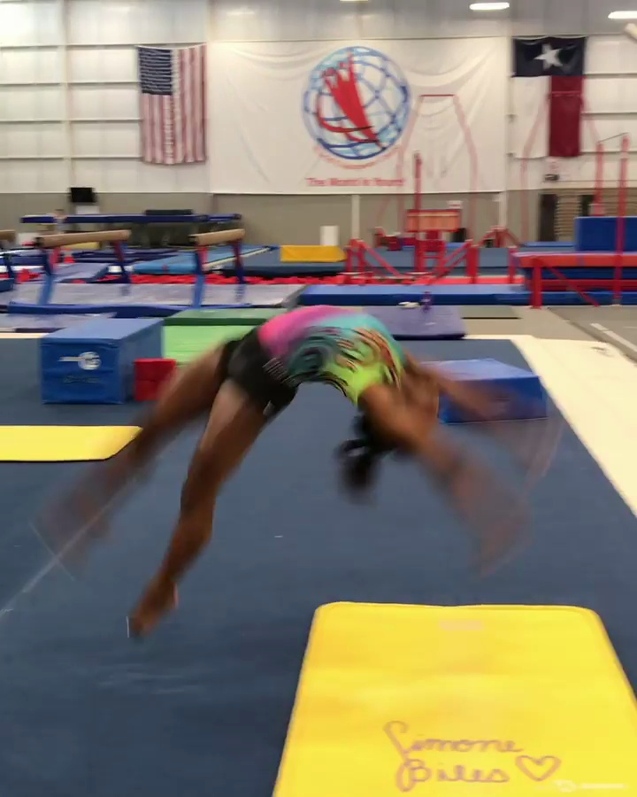
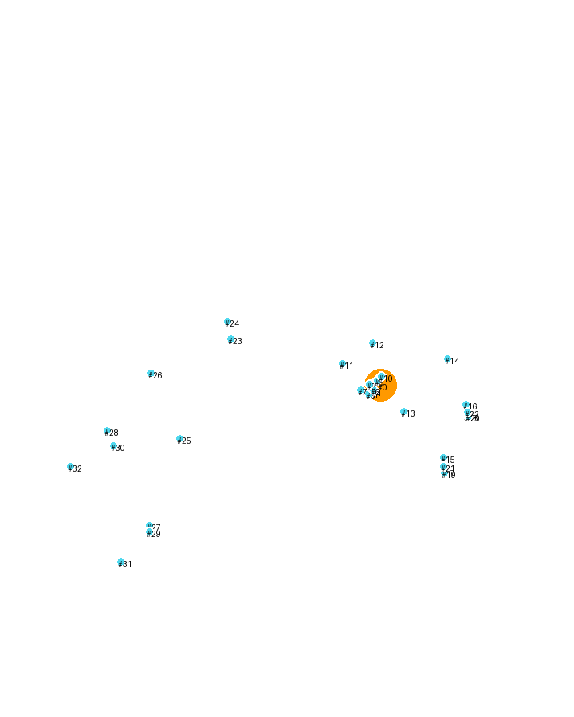
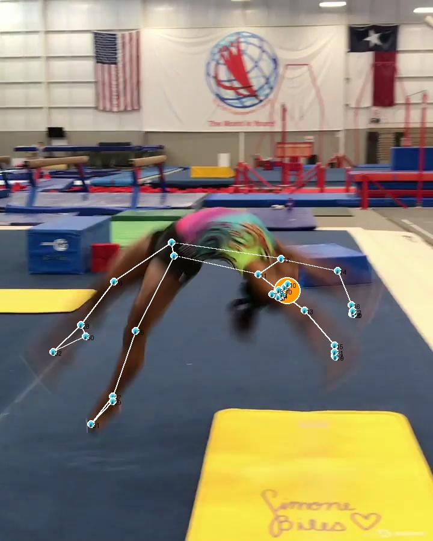
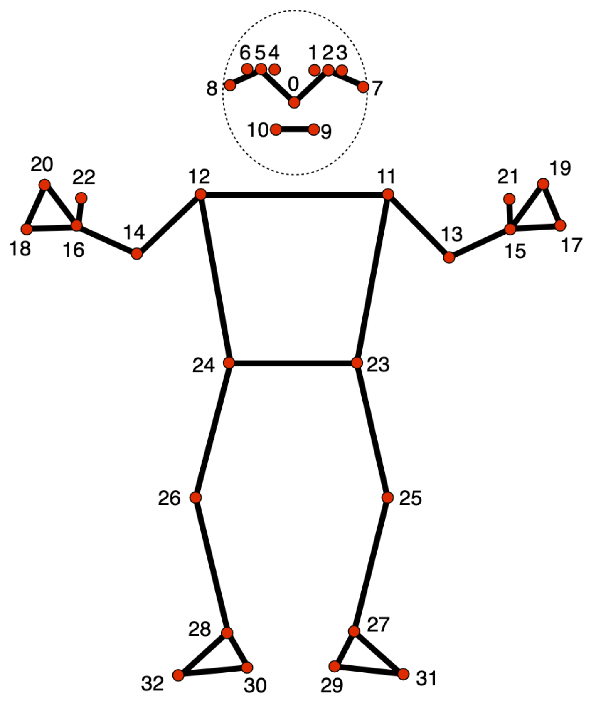

# Gymnastics Coaching Video Analysis

This repository contains tools for analyzing gymnastics coaching videos using computer vision and pose estimation. Using
MediaPipe's pose landmarker model, it tracks 33 key body landmarks to help coaches and athletes analyze form, technique,
and movement patterns.

## Sample Output

| Original                             | Pose Detection                                 | Composite                                                |
|--------------------------------------|------------------------------------------------|----------------------------------------------------------|
|  |  |  |

## How it works

The script uses MediaPipe to detect human pose landmarks in video frames

1. Extracts frames from a video file at specified intervals (creates an image sequence)
2. Processes each image to detect pose landmarks using Mediapipe (nose, eyes, shoulders, etc.)
3. Creates outputs
   - Original video frames (in /frames)
   - Pose overlay images with connected landmarks (in /poses)
   - Composite images combining original + pose overlay (in /final)


## Getting Started

```
uv venv
source .venv/bin/activate
uv install
uv run pose-estimation.py
```

## Dependencies

- [Mediapipe](https://ai.google.dev/edge/mediapipe/solutions/vision/pose_landmarker)

## Pose landmarker model

The pose landmarker model tracks 33 body landmark locations, representing the approximate location of the following body
parts:



### Face Landmarks

- 0: nose
- 1: left eye (inner)
- 2: left eye
- 3: left eye (outer)
- 4: right eye (inner)
- 5: right eye
- 6: right eye (outer)
- 7: left ear
- 8: right ear
- 9: mouth (left)
- 10: mouth (right)

### Upper Body Landmarks

- 11: left shoulder
- 12: right shoulder
- 13: left elbow
- 14: right elbow
- 15: left wrist
- 16: right wrist

### Hand Landmarks

- 17: left pinky
- 18: right pinky
- 19: left index
- 20: right index
- 21: left thumb
- 22: right thumb

### Lower Body Landmarks

- 23: left hip
- 24: right hip
- 25: left knee
- 26: right knee
- 27: left ankle
- 28: right ankle

### Foot Landmarks

- 29: left heel
- 30: right heel
- 31: left foot index
- 32: right foot index

## Possible Datasets

- https://sdolivia.github.io/FineGym/
- https://paperswithcode.com/dataset/rhythmic-gymnastic
